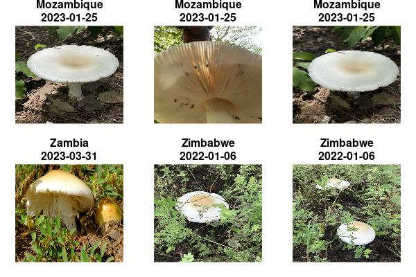

# package overview

 

The [suwo](https://docs.ropensci.org/suwo/) package aims to simplify the
retrieval of nature media (mostly photos, audio files and videos) across
multiple online biodiversity databases. This vignette provides an
overview of the package’s core querying functions, the searching and
downloading of media files, and the compilation of metadata from various
sources. For detailed information on each function, please refer to the
[function
reference](https://docs.ropensci.org/suwo/reference/index.html) or use
the help files within R (e.g.,
[`?query_gbif`](https://docs.ropensci.org/suwo/reference/query_gbif.md)).

**Intended use and responsible practices**

This package is designed exclusively for non-commercial, scientific
purposes, including research, education, and conservation. **Commercial
use of data or media retrieved through this package is the user’s
responsibility and is allowed only when the applicable license of the
source database explicitly permits such use, or when explicit, separate
permission has been obtained directly from the original source platforms
or rights holders**. Users must comply with the specific terms of
service and data-use policies of each source database, which may require
attribution and may further restrict commercial application. The package
developers assume no liability for misuse of the retrieved data or for
violations of third-party terms of service.

## Installation

Installing from CRAN:

``` r

#Install from CRAN:

# From CRAN would be
install.packages("suwo")

#load package
library(suwo)
```

Install the latest development version from GitHub:

``` r

install.packages("suwo", repos = c(
  'https://ropensci.r-universe.dev',
  'https://cloud.r-project.org'
))

#load package
library(suwo)
```

## Basic workflow for obtaining nature media files

Obtaining nature media using [suwo](https://docs.ropensci.org/suwo/)
follows a basic sequence. The following diagram illustrates this
workflow and the main functions involved:

![Flowchart of the suwo workflow for obtaining nature media files. Step
1, 'Get metadata', includes multiple boxes representing queries to
different repositories, such as query_wikiaves() and query_xenocanto(),
plus additional possible query\_() calls. Arrows from all these queries
converge into Step 2, 'Combine metadata', using merge_metadata(). The
process then moves to Step 3, 'Remove duplicates', using
find_duplicates() and remove_duplicates(). Next is Step 4, 'Download
media files', using download_media(). Finally, Step 5, 'Update
metadata', using update_metadata(), loops back toward the earlier steps,
indicating that metadata can be updated after downloading and re-enter
the workflow.](workflow_diagram.png)

Here is a description of each step:

Obtain metadata:

1.  Queries regarding a species are submitted through one of the
    available query functions (`query_repo_name()`) that connect to five
    different online repositories (Xeno-Canto, Inaturalist, GBIF,
    Macaulay Library and WikiAves). The output of these queries is a
    data frame containing metadata associated with the media files
    (e.g., species name, date, location, etc, see below).

Curate metadata:

1.  If multiple repositories are queried, the resulting metadata data
    frames can be merged into a single data frame using the
    [merge_metadata()](https://docs.ropensci.org/suwo/reference/merge_metadata.html)
    function.

2.  Check for duplicate records in their datasets using the
    [find_duplicates()](https://docs.ropensci.org/suwo/reference/find_duplicates.html)
    function. Candidate duplicated entries are identified based on
    matching species name, country, date, user name, and geographic
    coordinates. User can double check the candidate duplicates and
    decide which records to keep, which can be done with
    [remove_duplicates()](https://docs.ropensci.org/suwo/reference/remove_duplicates.html).

3.  Download the media files associated with the metadata using the
    [download_media()](https://docs.ropensci.org/suwo/reference/download_media.html)
    function.

4.  Users can update their datasets with new records using the
    [update_metadata()](https://docs.ropensci.org/suwo/reference/update_metadata.html)
    function.

## Obtaining metadata: the query functions

The following table summarizes the available
[suwo](https://docs.ropensci.org/suwo/) query functions and the types of
metadata they retrieve:

| Function | Repository | URL link | File types | Additional requirements | Taxonomic level | Geographic coverage | Taxonomic coverage | Other features |
|:---|:---|:---|:---|:---|:---|:---|:---|:---|
| [query_gbif](https://docs.ropensci.org/suwo/reference/query_gbif.html) | GBIF | [https://www.gbif.org/](https://www.gbif.org/) | image, sound, video, interactive resource | No | Species | Global | All life | Specify query by data base |
| [query_inaturalist](https://docs.ropensci.org/suwo/reference/query_inaturalist.html) | iNaturalist | [https://www.inaturalist.org/](https://www.inaturalist.org/) | image, sound | No | Species | Global | All life |  |
| [query_macaulay](https://docs.ropensci.org/suwo/reference/query_macaulay.html) | Macaulay Library | [https://www.macaulaylibrary.org/](https://www.macaulaylibrary.org/) | image, sound, video | Manual CSV export (every query) | Species | Global | Mostly birds but also other vertebrates and invertebrates |  |
| [query_wikiaves](https://docs.ropensci.org/suwo/reference/query_wikiaves.html) | WikiAves | [https://www.wikiaves.com.br/](https://www.wikiaves.com.br/) | image, sound | Browser authentication (access_wikiaves(), once per session) | Species | Brazil | Birds |  |
| [query_xenocanto](https://docs.ropensci.org/suwo/reference/query_xenocanto.html) | Xeno-Canto | [https://www.xeno-canto.org/](https://www.xeno-canto.org/) | sound | API key | Species, subspecies, genus, family, group | Global | Birds, frogs, non-marine mammals and grasshoppers | Specify query by taxonomy, geographic range and dates |

Table 1: Summary of query functions and the associated repositories.
{.table .table .table-striped .table-hover .table-condensed
.table-responsive style="width: auto !important; "}

These are some example queries:

1.  Images of Sarapiqui Heliconia (*Heliconia sarapiquensis*) from
    iNaturalist (we print the first 4 rows of each output data frame):

``` r

# Load suwo package
library(suwo)
```

    Warning in library(suwo): package 'suwo' already present in search()

``` r

h_sarapiquensis <- query_inaturalist(species = "Heliconia sarapiquensis",
                                     format = "image")
```

    ✔ Obtaining metadata (30 matching records found) 🎉

``` r

head(h_sarapiquensis, 4)
```

| repository | format | key | species | date | time | user_name | country | locality | latitude | longitude | file_url | file_extension | observation_url |
|:--:|:--:|:--:|:--:|:--:|:--:|:--:|:--:|:--:|:--:|:--:|:--:|:--:|:--:|
| iNaturalist | image | 385749639 | Heliconia sarapiquensis | 2026-07-25 | 10:31 | Cristhianrnz | NA | 10.1736116667,-83.91385 | 10.17361 | -83.91385 | <https://inaturalist-open-data.s3.amazonaws.com/photos/706218675/original.jpg> | jpeg | <https://www.inaturalist.org/observations/385749639> |
| iNaturalist | image | 330280680 | Heliconia sarapiquensis | 2025-12-08 | 13:47 | Carlos g Velazco-Macias | NA | 10.159645,-83.9378766667 | 10.15964 | -83.93788 | <https://inaturalist-open-data.s3.amazonaws.com/photos/598874322/original.jpg> | jpeg | <https://www.inaturalist.org/observations/330280680> |
| iNaturalist | image | 330280680 | Heliconia sarapiquensis | 2025-12-08 | 13:47 | Carlos g Velazco-Macias | NA | 10.159645,-83.9378766667 | 10.15964 | -83.93788 | <https://inaturalist-open-data.s3.amazonaws.com/photos/598874346/original.jpg> | jpeg | <https://www.inaturalist.org/observations/330280680> |
| iNaturalist | image | 330280680 | Heliconia sarapiquensis | 2025-12-08 | 13:47 | Carlos g Velazco-Macias | NA | 10.159645,-83.9378766667 | 10.15964 | -83.93788 | <https://inaturalist-open-data.s3.amazonaws.com/photos/598874381/original.jpg> | jpeg | <https://www.inaturalist.org/observations/330280680> |

2.  Harpy eagles (*Harpia harpyja*) audio recordings from WikiAves:

WikiAves is protected by Cloudflare’s bot detection, so
[query_wikiaves()](https://docs.ropensci.org/suwo/reference/query_wikiaves.html)
requires authentication cookies obtained beforehand with
[access_wikiaves()](https://docs.ropensci.org/suwo/reference/access_wikiaves.html);
see the [query_wikiaves() section](#query_wikiaves) below for details:

``` r

# get cookies for WikiAves (only needs to be done once per session)
access_wikiaves()
```

    ℹ Chrome not found on port 9333 -- launching it now... 

    ℹ On Cloudflare challenge page -- waiting up to 30s for it to clear (solve manually in the Chrome window) 

    ✔ Cookies successfully retrieved from Chrome. 🌈

    ✔ Saved to the `wikiaves_cookies` environment variable for this session. 😸

``` r

h_harpyja <- query_wikiaves(species = "Harpia harpyja", format = "sound")
```

    ✔ Obtaining metadata (80 matching records found) 😸

``` r

head(h_harpyja, 4)
```

| repository | format | key | species | date | time | user_name | country | locality | latitude | longitude | file_url | file_extension | observation_url |
|:--:|:--:|:--:|:--:|:--:|:--:|:--:|:--:|:--:|:--:|:--:|:--:|:--:|:--:|
| WikiAves | sound | 25867 | Harpia harpyja | NA | NA | Gustavopedersoli | Brazil | Alta Floresta/MT | NA | NA | <https://s3.amazonaws.com/media.wikiaves.com.br/recordings/52/25867_a73f0e8da2179e82af223ff27f74a912.mp3> | mp3 | <https://www.wikiaves.com.br/25867> |
| WikiAves | sound | 2701424 | Harpia harpyja | 2020-10-20 | NA | Brunolima | Brazil | Itanhaém/SP | NA | NA | <https://s3.amazonaws.com/media.wikiaves.com.br/recordings/1072/2701424_e0d533b952b64d6297c4aff21362474b.mp3> | mp3 | <https://www.wikiaves.com.br/2701424> |
| WikiAves | sound | 878999 | Harpia harpyja | 2013-03-20 | NA | Tbs | Brazil | Alta Floresta/MT | NA | NA | <https://s3.amazonaws.com/media.wikiaves.com.br/recordings/878/878999_c1f8f4ba81fd597548752e92f1cdba50.mp3> | mp3 | <https://www.wikiaves.com.br/878999> |
| WikiAves | sound | 3027120 | Harpia harpyja | 2016-06-20 | NA | Ciroalbano | Brazil | Camacan/BA | NA | NA | <https://s3.amazonaws.com/media.wikiaves.com.br/recordings/7203/3027120_5148ce0fed5fe99aba7c65b2f045686a.mp3> | mp3 | <https://www.wikiaves.com.br/3027120> |

3.  Common raccoon (*Procyon lotor*) videos from GBIF:

``` r

p_lotor <- query_gbif(species = "Procyon lotor", format = "video")
```

    ✖ No matching records found 😵

``` r

head(p_lotor, 4)
```

    NULL

------------------------------------------------------------------------

By default all query function return the 14 most basic metadata fields
associated with the media files. Here is the definition of each field:

- **repository**: Name of the repository
- **format**: Type of media file (e.g., sound, photo, video)
- **key**: Unique identifier of the media file in the repository
- **species**: Species name associated with the media file (Note
  taxonomic authority may vary among repositories)
- **date**\*: Date when the media file was recorded/photographed (in
  YYYY-MM-DD format or YYYY if only year is available)
- **time**\*: Time when the media file was recorded/photographed (in
  HH:MM format)
- **user_name**\*: Name of the user who uploaded the media file
- **country**\*: Country where the media file was recorded/photographed
- **locality**\*: Locality where the media file was
  recorded/photographed
- **latitude**\*: Latitude of the location where the media file was
  recorded/photographed (in decimal degrees)
- **longitude**\*: Longitude of the location where the media file was
  recorded/photographed (in decimal degrees)
- **file_url**: URL link to the media file (used to download media
  files)
- **file_extension**: Extension of the media file (e.g., .mp3, .jpg,
  .mp4)
- **observation_url**: URL link to the original observation page in the
  repository (used to check the original metadata and media file)

*\* Can contain missing values (NAs)*

Users can also download all available metadata by setting the argument
`all_data = TRUE`. These are the additional metadata fields, on top of
the basic fields, that are retrieved by each query function:

| Function | Additional data |
|:---|:---|
| [query_gbif](https://docs.ropensci.org/suwo/reference/query_gbif.html) | datasetkey, publishingorgkey, installationkey, hostingorganizationkey, publishingcountry, protocol, lastcrawled, lastparsed, crawlid, basisofrecord, occurrencestatus, taxonkey, kingdom_code, phylum_code, class_code, order_code, family_key, genus_code, species_code, acceptedtaxonkey, scientificnameauthorship, acceptedscientificname, kingdom, phylum, order, family, genus, genericname, specific_epithet, taxonrank, taxonomicstatus, iucnredlistcategory, continent, year, month, day, startdayofyear, enddayofyear, lastinterpreted, license, organismquantity, organismquantitytype, issequenced, isincluster, datasetname, recordist, identifiedby, samplingprotocol, geodeticdatum, class, countrycode, gbifregion, publishedbygbifregion, recordnumber, identifier, habitat, institutionid, verbatimeventdate, dynamicproperties, verbatimcoordinatesystem, eventremarks, gbifid, collectioncode, occurrenceid, institutioncode, identificationqualifier, media_type, page, state_province, comments |
| [query_inaturalist](https://docs.ropensci.org/suwo/reference/query_inaturalist.html) | quality_grade, taxon_geoprivacy, uuid, cached_votes_total, identifications_most_agree, species_guess, identifications_most_disagree, positional_accuracy, comments_count, site_id, created_time_zone, license_code, observed_time_zone, public_positional_accuracy, oauth_application_id, created_at, description, time_zone_offset, observed_on, observed_on_string, updated_at, captive, faves_count, num_identification_agreements, identification_disagreements_count, map_scale, uri, community_taxon_id, owners_identification_from_vision, identifications_count, obscured, num_identification_disagreements, geoprivacy, spam, mappable, identifications_some_agree, place_guess, id, license_code_1, attribution, hidden |
| [query_macaulay](https://docs.ropensci.org/suwo/reference/query_macaulay.html) | common_name, background_species, caption, year, month, day, country_state_county, state_province, county, age_sex, behavior, playback, captive, collected, specimen_id, home_archive_catalog_number, recorder, microphone, accessory, partner_institution, ebird_checklist_id, unconfirmed, air_temp\_*c*, water_temp\_*c*, media_notes, observation_details, parent_species, species_code, taxon_category, taxonomic_sort, recordist_2, average_community_rating, number_of_ratings, asset_tags, original_image_height, original_image_width |
| [query_wikiaves](https://docs.ropensci.org/suwo/reference/query_wikiaves.html) | user_id, species_code, common_name, repository_id, verified, locality_id, number_of_comments, likes, visualizations, duration |
| [query_xenocanto](https://docs.ropensci.org/suwo/reference/query_xenocanto.html) | genus, specific_epithet, subspecies, taxonomic_group, english_name, altitude, vocalization_type, sex, stage, method, url, uploaded_file, license, quality, length, upload_date, other_species, comments, animal_seen, playback_used, temp, regnr, auto, recorder, microphone, sampling_rate, sonogram_small, sonogram_med, sonogram_large, sonogram_full, oscillogram_small, oscillogram_med, oscillogram_large, sonogram |

Table 2: Additional metadata per query function. {.table .table
.table-striped .table-hover .table-condensed .table-responsive
style="width: auto !important; "}

**Obtaining raw data**

By default the package standardizes the information in the basic fields
(detailed above) in order to facilitate the compilation of metadata from
multiple repositories. However, in some cases this may result in loss of
information. For instance, some repositories allow users to provide
“morning” as a valid time value, which are converted into NAs by
[suwo](https://docs.ropensci.org/suwo/). In such cases, users can
retrieve the original data by setting the `raw_data = TRUE` in the query
functions and/or global options (`options(raw_data = TRUE)`). Note that
subsequent data manipulation functions (e.g.,
[merge_metadata()](https://docs.ropensci.org/suwo/reference/merge_metadata.html),
[find_duplicates()](https://docs.ropensci.org/suwo/reference/find_duplicates.html),
etc) will not work as the basic fields are not standardized.

The code above examplifies the most common use of query functions, which
applies also to the function
[query_gbif()](https://docs.ropensci.org/suwo/reference/query_gbif.html).
The following sections provide more details on the two query functions
that require special considerations:
[query_macaulay()](https://docs.ropensci.org/suwo/reference/query_macaulay.html)
and
[query_xenocanto()](https://docs.ropensci.org/suwo/reference/query_xenocanto.html).

### query_macaulay()

#### Interactive retrieval of metadata

[query_macaulay()](https://docs.ropensci.org/suwo/reference/query_macaulay.html)
is the only interactive function. This means that when users run a query
the function opens a browser window to the [Macaulay Library’s search
page](https://search.macaulaylibrary.org/catalog), where the users must
download a .csv file with the metadata. Here is a example of a query for
strip-throated hermit (*Phaethornis striigularis*) videos:

``` r

p_striigularis <- query_macaulay(species = "Phaethornis striigularis",
                                 format = "video")
```

    ℹ A browser will open the macaulay library website. Save the .csv file ('export' button) to this directory: 
    /home/m/Dropbox/R_package_testing/suwo/vignettes/ 

    ℹ (R is monitoring for new CSV files. Press ESC to stop the function)

    ℹ File:  
    ML__2026-08-12T16-45_stther2_video.csv 

    ✔ 30 matching records found 🎊

Users must click on the “Export” button to save the .csv file with the
metadata:


Note that for bird species the species name must be valid according to
the Macaulay Library taxonomy (which follows the Clements checklist).
For non-bird species users must use the argument `taxon_code`. The
species taxon code can be found by running a search at the [Macaulay
Library’s search page](https://search.macaulaylibrary.org/catalog) and
checking the URL of the species page. For instance, the taxon code for
jaguar (*Panthera onca*) is “t-11032765”:


Once you have the taxon code, you can run the query as follows:

``` r

jaguar <- query_macaulay(taxon_code = "t-11032765",
                                 format = "video")
```

    ℹ A browser will open the macaulay library website. Save the .csv file ('export' button) to this directory: 
    /home/m/Dropbox/R_package_testing/suwo/vignettes/ 

    ℹ (R is monitoring for new CSV files. Press ESC to stop the function)

    ℹ File:  
    ML__2026-08-12T16-45_t-11032765_video.csv 

    ✔ 37 matching records found 🥇

Here are some tips for using this function properly:

- Valid bird species names can be checked at
  `suwo:::ml_taxon_code$SCI_NAME`
- The exported csv file must be saved in the directory specified by the
  argument `path` of the function (default is the current working
  directory)
- The function will not proceed until the file is saved (press ESC to
  stop the function)
- Do not overwritte files : if the file is saved overwriting a
  pre-existing file (i.e. same file name) the function will not detect
  it
- Users must log in to the Macaulay Library/eBird account in order to
  access large batches of observations

After saving the file, the function will read the file and return a data
frame with the metadata. Here we print the first 4 rows of the output
data frame:

``` r

head(p_striigularis, 4)
```

| repository | format | key | species | date | time | user_name | country | locality | latitude | longitude | file_url | file_extension | observation_url |
|:--:|:--:|:--:|:--:|:--:|:--:|:--:|:--:|:--:|:--:|:--:|:--:|:--:|:--:|
| Macaulay Library | video | 660763140 | Phaethornis striigularis | 2026-06-30 | 10:28 | Carlos Viquez | Panama | Camino a Cascada de Chorcha | 8.411990 | -82.21932 | <https://cdn.download.ams.birds.cornell.edu/api/v1/asset/660763140/> | mp4 | <https://macaulaylibrary.org/asset/660763140> |
| Macaulay Library | video | 656764975 | Phaethornis striigularis | 2026-03-12 | 09:37 | Anthony Marella | Colombia | Hotel Tinamú Birding Nature Reserve | 5.064686 | -75.59220 | <https://cdn.download.ams.birds.cornell.edu/api/v1/asset/656764975/> | mp4 | <https://macaulaylibrary.org/asset/656764975> |
| Macaulay Library | video | 656313242 | Phaethornis striigularis | 2026-05-01 | 16:50 | Jessy Lopez Herra | Costa Rica | Bijagua–Tapir Valley | 10.716530 | -85.01138 | <https://cdn.download.ams.birds.cornell.edu/api/v1/asset/656313242/> | mp4 | <https://macaulaylibrary.org/asset/656313242> |
| Macaulay Library | video | 654011852 | Phaethornis striigularis | 2026-03-15 | 06:56 | Bret Whitney | Mexico | Camino La Guadalupe–La Reforma | 17.847230 | -96.03763 | <https://cdn.download.ams.birds.cornell.edu/api/v1/asset/654011852/> | mp4 | <https://macaulaylibrary.org/asset/654011852> |

#### Bypassing record limit

Even if logged in, a maximum of 10000 records per query can be returned.
This can be bypassed by using the argument `dates` to split the search
into a sequence of shorter date ranges. The rationale is that by
splitting the search into date ranges, users can download multiple .csv
files, which are then combined by the function into a single metadata
data frame. Of course users must download the csv for each data range.
The following code looks for photos of costa’s hummingbird (*Calypte
costae*). As Macaulay Library hosts more than 30000 costa’s hummingbird
records, we need to split the query into multiple date ranges:

``` r

# test a query with more than 10000 results paging by date
cal_cos <- query_macaulay(
  species = "Calypte costae",
  format = "image",
  dates = c(1976, 2020, 2022, 2024, 2025, 2026)
)
```

    ℹ A browser will open the macaulay library website. Save the .csv file ('export' button) to this directory: 
    /home/m/Dropbox/R_package_testing/suwo/vignettes/ 

    ℹ (R is monitoring for new CSV files. Press ESC to stop the function)

    • Query 1 of 5 (1976-2019):

    ℹ File:  
    ML__2026-08-12T16-46_coshum_photo.csv 

    • Query 2 of 5 (2020-2021):

    ℹ File:  
    ML__2026-08-12T16-46_coshum_photo2.csv 

    • Query 3 of 5 (2022-2023):

    ℹ File:  
    ML__2026-08-12T16-47_coshum_photo.csv 

    • Query 4 of 5 (2024):

    ℹ File:  
    ML__2026-08-12T16-48_coshum_photo.csv 

    • Query 5 of 5 (2025-2026):

    ℹ File:  
    ML__2026-08-12T16-48_coshum_photo2.csv 

    ✔ 41040 matching records found 🎊

Users can check at the Macaulay Library website how many records are
available for their species of interest (see image below) and then
decide how to split the search by date ranges accordingly so each
sub-query has less than 10000 records.


[query_macaulay()](https://docs.ropensci.org/suwo/reference/query_macaulay.html)
can also read metadata previously downloaded from [Macaulay Library
website](https://www.macaulaylibrary.org/). To do this, users must
provide 1) the name of the csv file(s) to the argument `files` and 2)
the directory path were it was saved to the argument `path`.

### query_wikiaves()

WikiAves (<https://www.wikiaves.com.br>) sits behind Cloudflare’s bot
protection. Plain HTTP requests – including the ones
[query_wikiaves()](https://docs.ropensci.org/suwo/reference/query_wikiaves.html)
would otherwise send directly – are blocked with an HTTP 403 error. To
get around this,
[access_wikiaves()](https://docs.ropensci.org/suwo/reference/access_wikiaves.html)
drives a real, visible Google Chrome or Chromium browser through the
Chrome DevTools Protocol: it opens (or reuses) a Chrome window pointed
at WikiAves, waits for Cloudflare’s challenge to clear, and extracts the
resulting authentication cookies and browser user agent. The result is a
single character string that
[query_wikiaves()](https://docs.ropensci.org/suwo/reference/query_wikiaves.html)
uses to authenticate its own requests.

**Requirements for
[`access_wikiaves()`](https://docs.ropensci.org/suwo/reference/access_wikiaves.md)**

This function requires a local installation of Google Chrome (or
Chromium) and a usable display, so it will not work on headless servers
without additional setup. It also requires the `websocket` and `later`
packages, which are optional (`Suggests`) dependencies of
[suwo](https://docs.ropensci.org/suwo/) – install them with
`install.packages(c("websocket", "later"))` if they are not already
available.

To use
[query_wikiaves()](https://docs.ropensci.org/suwo/reference/query_wikiaves.html)
you must first obtain a valid cookies string using
[access_wikiaves()](https://docs.ropensci.org/suwo/reference/access_wikiaves.html).

Call
[access_wikiaves()](https://docs.ropensci.org/suwo/reference/access_wikiaves.html)
once to obtain a cookies which would be internally passed to
[query_wikiaves()](https://docs.ropensci.org/suwo/reference/query_wikiaves.html)’s
`cookies` argument:

``` r

# opens (or reuses) a Chrome window, waits for the Cloudflare challenge to clear
access_wikiaves()

h_harpyja <- query_wikiaves(species = "Harpia harpyja", format = "sound")
```

The function saves the cookies string to the R environment variable
`wikiaves_cookies` which is read by default by
[query_wikiaves()](https://docs.ropensci.org/suwo/reference/query_wikiaves.html).

Because the underlying Cloudflare cookie (`cf_clearance`) is typically
only valid for around an hour,
[`access_wikiaves()`](https://docs.ropensci.org/suwo/reference/access_wikiaves.md)
does not need to be called before every single query – just once per
session, or again whenever a
[`query_wikiaves()`](https://docs.ropensci.org/suwo/reference/query_wikiaves.md)
call starts failing with an HTTP 403.

### query_xenocanto()

#### API key

[Xeno-Canto](https://www.xeno-canto.org/) requires users to obtain a
free API key to use [their API
v3](https://xeno-canto.org/admin.php/explore/api). Users can get their
API key by creating an account at [Xeno-Canto’s registering
page](https://xeno-canto.org/auth/register). Once users have their API
key, they can set it as a variable in your R environment using
`Sys.setenv(xc_api_key = "YOUR_API_KEY_HERE")` and
[query_xenocanto()](https://docs.ropensci.org/suwo/reference/query_xenocanto.html)
will use it. Here is an example of a query for Spix’s disc-winged bat
(*Thyroptera tricolor*) audio recordings:

``` r

#  set your Xeno-Canto key as environmental variable (run it on the console)
# Sys.setenv(xc_api_key = "YOUR_API_KEY_HERE")

# query Xeno-CAnto
t_tricolor <- query_xenocanto(species = "Thyroptera tricolor")
```

    ℹ Obtaining metadata: 

    ✔ 6 matching sound files found 🥳

``` r

# we remove urls to avoid CRAN issues
head(t_tricolor[, grep("url", names(t_tricolor), invert = TRUE)], 4)
```

| repository | format | key | species | date | time | user_name | country | locality | latitude | longitude | file_extension |
|:--:|:--:|:--:|:--:|:--:|:--:|:--:|:--:|:--:|:--:|:--:|:--:|
| Xeno-Canto | sound | 879621 | Thyroptera tricolor | 2023-07-15 | 12:30 | José Tinajero | Costa Rica | Hacienda Baru, Dominical, Costa Rica | 9.2635 | -83.8768 | wav |
| Xeno-Canto | sound | 820604 | Thyroptera tricolor | 2013-01-10 | 19:00 | Sébastien J. Puechmaille | Costa Rica | Pavo, Provincia de Puntarenas | 8.4815 | -83.5945 | wav |
| Xeno-Canto | sound | 820603 | Thyroptera tricolor | 2013-01-10 | 19:00 | Sébastien J. Puechmaille | Costa Rica | Pavo, Provincia de Puntarenas | 8.4815 | -83.5945 | wav |
| Xeno-Canto | sound | 821928 | Thyroptera tricolor | 2013-01-10 | 19:00 | Daniel j buckley | Costa Rica | Pavo, Provincia de Puntarenas | 8.4815 | -83.5945 | wav |

#### Special queries

[query_xenocanto()](https://docs.ropensci.org/suwo/reference/query_xenocanto.html)
allows users to perform special queries by specifying additional query
tags. Users can also search by country, taxonomy (taxonomic group,
family, genus, subspecies), geography (country, location, geographic
coordinates) date, sound type (e.g. female song, calls) and recording
properties (quality, length, sampling rate) ([see list of available tags
here](https://xeno-canto.org/admin.php/explore/api#examples)). Here is
an example of a query for audio recordings of pale-striped poison frog
(*Ameerega hahneli*, ’sp:“Ameerega hahneli”) from French Guiana
(cnt:“French Guiana”) and with the highest recording quality (q:“A”):

``` r

# assuming you already set your API key as in previous code block
a_hahneli <- query_xenocanto(
  species = 'sp:"Ameerega hahneli" cnt:"French Guiana" q:"A"')
```

    ℹ Obtaining metadata: 

    ✔ 3 matching sound files found 🌈

``` r

# we remove urls to avoid CRAN issues
head(a_hahneli[, grep("url", names(a_hahneli), invert = TRUE)], 4)
```

| repository | format | key | species | date | time | user_name | country | locality | latitude | longitude | file_extension |
|:--:|:--:|:--:|:--:|:--:|:--:|:--:|:--:|:--:|:--:|:--:|:--:|
| Xeno-Canto | sound | 928987 | Ameerega hahneli | 2024-05-14 | 16:00 | Augustin Bussac | French Guiana | Sentier Gros-Arbre | 3.6132 | -53.2169 | mp3 |
| Xeno-Canto | sound | 928972 | Ameerega hahneli | 2024-04-24 | 17:00 | Augustin Bussac | French Guiana | Camp Bonaventure | 4.3226 | -52.3387 | mp3 |
| Xeno-Canto | sound | 928971 | Ameerega hahneli | 2023-11-26 | 13:00 | Augustin Bussac | French Guiana | Guyane Natural Regional Park (near Roura), Arrondissement of Cayenne | 4.5423 | -52.4432 | mp3 |

## Update metadata

The
[update_metadata()](https://docs.ropensci.org/suwo/reference/update_metadata.html)
function allows users to update a previous query to add new information
from the corresponding repository of the original search. This function
takes as input a data frame previously obtained from any query function
(i.e. `query_reponame()`) and returns a data frame similar to the input
with new data appended.

To show case the function, we first query metadata of Eisentraut’s
Bow-winged Grasshopper sounds from iNaturalist. Let’s assume that the
initial query was done a while ago and we want to update it to include
any new records that might have been added since then. The following
code removes all observations recorded after 2024-12-31 to simulate an
old query:

``` r

# initial query
c_eisentrauti <- query_inaturalist(species = "Chorthippus eisentrauti")
```

    ✔ Obtaining metadata (124 matching records found) 🌈

``` r

head(c_eisentrauti, 3)
```

| repository | format | key | species | date | time | user_name | country | locality | latitude | longitude | file_url | file_extension | observation_url |
|:--:|:--:|:--:|:--:|:--:|:--:|:--:|:--:|:--:|:--:|:--:|:--:|:--:|:--:|
| iNaturalist | image | 390102665 | Chorthippus eisentrauti | 2026-08-08 | 10:14 | Valentin Monnoy | NA | 44.7590916667,6.995605 | 44.75909 | 6.995605 | <https://inaturalist-open-data.s3.amazonaws.com/photos/714642888/original.jpg> | jpeg | <https://www.inaturalist.org/observations/390102665> |
| iNaturalist | image | 390102665 | Chorthippus eisentrauti | 2026-08-08 | 10:14 | Valentin Monnoy | NA | 44.7590916667,6.995605 | 44.75909 | 6.995605 | <https://inaturalist-open-data.s3.amazonaws.com/photos/714642916/original.jpg> | jpeg | <https://www.inaturalist.org/observations/390102665> |
| iNaturalist | image | 388776852 | Chorthippus eisentrauti | 2026-08-04 | 14:25 | Fabian A. Boetzl | NA | 47.5536075163,12.9628660784 | 47.55361 | 12.962866 | <https://inaturalist-open-data.s3.amazonaws.com/photos/712078297/original.jpg> | jpeg | <https://www.inaturalist.org/observations/388776852> |

``` r

# exclude new observations (simulate old data)
old_c_eisentrauti <-
  c_eisentrauti[c_eisentrauti$date <= "2024-12-31" | is.na(c_eisentrauti$date),
                ]

# update "old" data
upd_c_eisentrauti <- update_metadata(metadata = old_c_eisentrauti)
```

    ✔ Obtaining metadata (124 matching records found) 🥳

    ✔ 111 new entries found 🥳

``` r

# compare number of records
nrow(c_eisentrauti) == nrow(upd_c_eisentrauti)
```

    [1] TRUE

The function
[update_metadata()](https://docs.ropensci.org/suwo/reference/update_metadata.html)
only accepts metadata data frames originating from a single repository.
For workflows involving multiple repositories, users can apply the
function separately to each subset of metadata; see the [examples in the
function
documentation](https://docs.ropensci.org/suwo/reference/update_metadata.html#ref-examples)
for an illustration of this approach.

## Combine metadata from multiple repositories

The
[merge_metadata()](https://docs.ropensci.org/suwo/reference/merge_metadata.html)
function allows users to combine metadata data frames obtained from
multiple query functions into a single data frame. The function will
match the basic columns of all data frames. Data from additional columns
(for instance when using `all_data = TRUE` in the query) will only be
combined if the column names from different repositories match. The
function will return a data frame that includes a new column called
`source` indicating the name of the original metadata data frame:

``` r

truf_xc <- query_xenocanto(species = "Turdus rufiventris")
```

    ℹ Obtaining metadata: 

    ✔ 492 matching sound files found 🎊

``` r

truf_gbf <- query_gbif(species = "Turdus rufiventris", format = "sound")
```

    ✔ Obtaining metadata (788 matching records found) 🥳

    ! 2 observations do not have a download link and were removed from the results (included as an attribute called 'excluded_results'). 

``` r

truf_ml <- query_macaulay(species = "Turdus rufiventris",
                          format = "sound")
```

    ℹ A browser will open the macaulay library website. Save the .csv file ('export' button) to this directory: 
    /home/m/Dropbox/R_package_testing/suwo/vignettes/ 

    ℹ (R is monitoring for new CSV files. Press ESC to stop the function)

    ℹ File:  
    ML__2026-08-12T16-50_rubthr1_audio.csv 

    ✔ 1473 matching records found 😀

``` r

# merge metadata
merged_metadata <- merge_metadata(truf_xc, truf_gbf, truf_ml)

# we remove urls to avoid CRAN issues
head(merged_metadata[, grep("url", names(merged_metadata), invert = TRUE)], 4)
```

| repository | format | key | species | date | time | user_name | country | locality | latitude | longitude | file_extension | source |
|:--:|:--:|:--:|:--:|:--:|:--:|:--:|:--:|:--:|:--:|:--:|:--:|:--:|
| Xeno-Canto | sound | 1141578 | Turdus rufiventris | 2025-11-17 | 12:32 | Franco Vushurovich | Argentina | Victoria, Entre Ríos | -32.8606 | -60.6486 | wav | truf_xc |
| Xeno-Canto | sound | 1135373 | Turdus rufiventris | 2026-05-14 | 06:50 | Jayrson Araujo De Oliveira | Brazil | Reserva Fazenda Capivara - Santo Antônio de Goiás | -16.5108 | -49.2939 | mp3 | truf_xc |
| Xeno-Canto | sound | 1096135 | Turdus rufiventris | 2025-11-09 | 11:50 | Franco Vushurovich | Argentina | Victoria, Entre Ríos | -32.8606 | -60.6486 | wav | truf_xc |
| Xeno-Canto | sound | 1080158 | Turdus rufiventris | 2025-12-30 | 17:27 | Jayrson Araujo De Oliveira | Brazil | Reserva do Setor Sítio de Recreio Caraíbas-Goiânia, Goiás | -16.5631 | -49.2850 | mp3 | truf_xc |

Note that in such a multi-repository query, all query functions use the
same search species (i.e. species name) and media format (e.g., sound,
image, video). To facilitate this, users can set the global options
`species` and `format` so they do not need to specify them in each query
function:

``` r

# query at multiple repositories setting global options
options(species = "Turdus rufiventris", format = "sound")
truf_xc <- query_xenocanto() # assuming you already set your API key
truf_gbf <- query_gbif()
truf_ml <- query_macaulay()

# merge metadata
merged_metadata <- merge_metadata(truf_xc, truf_gbf, truf_ml)
```

## Find and remove duplicated records

When compiling data from multiple repositories, duplicated media records
are a common issue, particularly for sound recordings. These duplicates
occur both through data sharing between repositories like Xeno-Canto and
GBIF, and when users upload the same file to multiple platforms. To help
users efficiently identify these duplicate records,
[suwo](https://docs.ropensci.org/suwo/) provides the
[find_duplicates()](https://docs.ropensci.org/suwo/reference/find_duplicates.html)
function. Duplicates are identified based on matching species name,
country, date, user name, and locality. The function uses a fuzzy
matching approach to account for minor variations in the data (e.g.,
typos, different location formats, etc).The output is a data frame with
the candidate duplicate records, allowing users to review and decide
which records to keep.

In this example we look for possible duplicates in the merged metadata
data frame from the previous section:

``` r

# find duplicates
dups_merged_metadata <- find_duplicates(merged_metadata)
```

    ℹ 686 potential duplicates found 

``` r

# look first 6 columns
head(dups_merged_metadata)
```

| repository | format | key | species | date | time | user_name | country | locality | latitude | longitude | file_url | file_extension | observation_url | source | duplicate_group |
|:--:|:--:|:--:|:--:|:--:|:--:|:--:|:--:|:--:|:--:|:--:|:--:|:--:|:--:|:--:|:--:|
| Xeno-Canto | sound | 1141578 | Turdus rufiventris | 2025-11-17 | 12:32 | Franco Vushurovich | Argentina | Victoria, Entre Ríos | -32.8606 | -60.6486 | <https://xeno-canto.org/1141578/download> | wav | <https://xeno-canto.org/1141578> | truf_xc | 1 |
| GBIF | sound | 6403541436 | Turdus rufiventris | 2025-11-17 | 12:32 | Franco Vushurovich | Argentina | Victoria, Entre Ríos | -32.8606 | -60.6486 | <https://xeno-canto.org/sounds/uploaded/VLDFGFKOWN/XC1141578-ZorzalColorado17deNovIsla2026.wav> | wav | <https://www.gbif.org/occurrence/6403541436> | truf_gbf | 1 |
| Xeno-Canto | sound | 1050568 | Turdus rufiventris | 2025-10-17 | 17:02 | Mateus Gonçalves Santos | Brazil | Nova Canaã, Bahia | -14.7317 | -40.2128 | <https://xeno-canto.org/1050568/download> | wav | <https://xeno-canto.org/1050568> | truf_xc | 2 |
| GBIF | sound | 5995361928 | Turdus rufiventris | 2025-10-17 | 17:02 | Mateus Gonçalves Santos | Brazil | Nova Canaã, Bahia | -14.7317 | -40.2128 | <https://xeno-canto.org/sounds/uploaded/PVWSUUVNDA/XC1050568-tur-ruf-2.wav> | wav | <https://www.gbif.org/occurrence/5995361928> | truf_gbf | 2 |
| Xeno-Canto | sound | 418792 | Turdus rufiventris | 2018-06-03 | 07:30 | Ricardo José Mitidieri | Brazil | Secretário, Petrópolis, Rio de Janeiro | -22.3270 | -43.1693 | <https://xeno-canto.org/418792/download> | mp3 | <https://xeno-canto.org/418792> | truf_xc | 3 |
| GBIF | sound | 2243808418 | Turdus rufiventris | 2018-06-03 | 07:30 | Ricardo José Mitidieri | Brazil | Secretário, Petrópolis, Rio de Janeiro | -22.3270 | -43.1693 | <https://xeno-canto.org/sounds/uploaded/CFRYARSVHN/XC418792-STE-026%20sabi%C3%A1-laranjeira%20xc.mp3> | mp3 | <https://www.gbif.org/occurrence/2243808418> | truf_gbf | 3 |

Note that the
[find_duplicates()](https://docs.ropensci.org/suwo/reference/find_duplicates.html)
function adds a new column called “duplicate_group” to the output data
frame. This column assigns a unique identifier to each group of
potential duplicates, allowing users to easily identify and review them.
For instance, in the example above, records from duplicated group 95
belong to the same user, were recorded on the same date and time and in
the same country:

``` r

subset(dups_merged_metadata, duplicate_group == 95)
```

| repository | format | key | species | date | time | user_name | country | locality | latitude | longitude | file_url | file_extension | observation_url | source | duplicate_group |
|:--:|:--:|:--:|:--:|:--:|:--:|:--:|:--:|:--:|:--:|:--:|:--:|:--:|:--:|:--:|:--:|
| Xeno-Canto | sound | 273100 | Turdus rufiventris | 2013-10-19 | 18:00 | Peter Boesman | Argentina | Calilegua NP, Jujuy | -23.74195 | -64.85777 | <https://xeno-canto.org/273100/download> | mp3 | <https://xeno-canto.org/273100> | truf_xc | 95 |
| Xeno-Canto | sound | 273098 | Turdus rufiventris | 2013-10-19 | 18:00 | Peter Boesman | Argentina | Calilegua NP, Jujuy | -23.74195 | -64.85777 | <https://xeno-canto.org/273098/download> | mp3 | <https://xeno-canto.org/273098> | truf_xc | 95 |
| GBIF | sound | 2243678570 | Turdus rufiventris | 2013-10-19 | 18:00 | Peter Boesman | Argentina | Calilegua NP, Jujuy | -23.74195 | -64.85777 | <https://xeno-canto.org/sounds/uploaded/OOECIWCSWV/XC273098-Rufous-bellied%20Thrush%20QQ%20call%20A%201.mp3> | mp3 | <https://www.gbif.org/occurrence/2243678570> | truf_gbf | 95 |
| GBIF | sound | 2243680322 | Turdus rufiventris | 2013-10-19 | 18:00 | Peter Boesman | Argentina | Calilegua NP, Jujuy | -23.74195 | -64.85777 | <https://xeno-canto.org/sounds/uploaded/OOECIWCSWV/XC273100-Rufous-bellied%20Thrush%20QQQ%20call%20A.mp3> | mp3 | <https://www.gbif.org/occurrence/2243680322> | truf_gbf | 95 |
| Macaulay Library | sound | 301276 | Turdus rufiventris | 2013-10-19 | 18:00 | Peter Boesman | Argentina | Calilegua NP | -23.74200 | -64.85780 | <https://cdn.download.ams.birds.cornell.edu/api/v1/asset/301276/> | mp3 | <https://macaulaylibrary.org/asset/301276> | truf_ml | 95 |
| Macaulay Library | sound | 301275 | Turdus rufiventris | 2013-10-19 | 18:00 | Peter Boesman | Argentina | Calilegua NP | -23.74200 | -64.85780 | <https://cdn.download.ams.birds.cornell.edu/api/v1/asset/301275/> | mp3 | <https://macaulaylibrary.org/asset/301275> | truf_ml | 95 |

In this case all the observations seem to refer to the same media file.
Therefore only one copy is needed. Also note that the locality is not
exactly the same for these records, but the fuzzy matching approach used
by
[find_duplicates()](https://docs.ropensci.org/suwo/reference/find_duplicates.html)
was able to identify them as potential duplicates. By default, the
criteria is set to
`country > 0.8 & locality > 0.5 & user_name > 0.8 & time == 1 & date == 1`
which means that two entries will be considered duplicates if they have
a country similarity greater than 0.8, locality similarity greater than
0.5, user_name similarity greater than 0.8, and exact matches for time
and date (similarities range from 0 to 1). These values have been found
to work well in most cases. Nonetheless, users can adjust the
sensitivity based on their specific needs using the argument `criteria`.

Once users have reviewed the candidate duplicates, they can apply the
[remove_duplicates()](https://docs.ropensci.org/suwo/reference/remove_duplicates.html)
function to eliminate unwanted duplicates from their metadata data
frames. This function takes as input a metadata output data frame from
[find_duplicates()](https://docs.ropensci.org/suwo/reference/find_duplicates.html):

``` r

# remove duplicates
dedup_metadata <- remove_duplicates(dups_merged_metadata)
```

    ℹ 311 duplicates removed 

The output is a data frame similar to the input but without the
specified duplicate records:

``` r

# look at first 4 columns of deduplicated metadata
# we remove urls to avoid CRAN issues
head(dedup_metadata[, grep("url", names(dedup_metadata), invert = TRUE)], 4)
```

| repository | format | key | species | date | time | user_name | country | locality | latitude | longitude | file_extension | source | duplicate_group |
|:--:|:--:|:--:|:--:|:--:|:--:|:--:|:--:|:--:|:--:|:--:|:--:|:--:|:--:|
| Xeno-Canto | sound | 1141578 | Turdus rufiventris | 2025-11-17 | 12:32 | Franco Vushurovich | Argentina | Victoria, Entre Ríos | -32.8606 | -60.6486 | wav | truf_xc | 1 |
| GBIF | sound | 6403541436 | Turdus rufiventris | 2025-11-17 | 12:32 | Franco Vushurovich | Argentina | Victoria, Entre Ríos | -32.8606 | -60.6486 | wav | truf_gbf | 1 |
| Xeno-Canto | sound | 1050568 | Turdus rufiventris | 2025-10-17 | 17:02 | Mateus Gonçalves Santos | Brazil | Nova Canaã, Bahia | -14.7317 | -40.2128 | wav | truf_xc | 2 |
| GBIF | sound | 5995361928 | Turdus rufiventris | 2025-10-17 | 17:02 | Mateus Gonçalves Santos | Brazil | Nova Canaã, Bahia | -14.7317 | -40.2128 | wav | truf_gbf | 2 |

When duplicates are found, one observation from each group of duplicates
is retained in the output data frame. However, if multiple observations
from the same repository are labeled as duplicates, by default
(`same_repo = FALSE`) all of them are retained in the output data frame.
This is useful as it can be expected that observations from the same
repository are not true duplicates (e.g. different recordings uploaded
to Xeno-Canto with the same date, time and location by the same user),
but rather have not been documented with enough precision to be told
apart. This behavior can be modified. If `same_repo = TRUE`, only one of
the duplicated observations from the same repository will be retained in
the output data frame (and all other excluded). The function will give
priority to repositories in which media downloading is more
straightforward (i.e. Xeno-Canto, GBIF), but this can be modified with
the argument `repo_priority`.

Further identification of duplicates can be done by checking the file
size of the media (ideally including it as a criterion in the ‘criteria’
argument). To obtain the file size, the media files need to be
downloaded first with the function
[download_media()](https://docs.ropensci.org/suwo/reference/download_media.html)
which returns the column `file_size` which can be used for this purpose.

## Download media files

The last step of the workflow is to download the media files associated
with the metadata. This can be done using the
[download_media()](https://docs.ropensci.org/suwo/reference/download_media.html)
function, which takes as input a metadata data frame (obtained from any
query function or any of the other metadata managing functions) and
downloads the media files to a specified directory. For this example we
will download images from a query on zambian slender Caesar (*Amanita
zambiana*) (a mushroom) on GBIF:

``` r

# query GBIF for Amanita zambiana images
a_zam <- query_gbif(species = "Amanita zambiana", format = "image")
```

    ✔ Obtaining metadata (7 matching records found) 🥇

``` r

# create folder for images
out_folder <- file.path(tempdir(), "amanita_zambiana")
dir.create(out_folder)

# download media files to a temporary directory
azam_files <- download_media(metadata = a_zam, path = out_folder)
```

    Downloading media files:

    ✔ All files were downloaded successfully 😸

The output of the function is a data frame similar to the input metadata
but with two additional columns indicating the file name of the
downloaded files (‘downloaded_file_name’) and the result of the download
attempt (‘download_status’, with values “success”, ‘failed’, ‘already
there (not downloaded)’ or ‘overwritten’).

Here we print the first 4 rows of the output data frame:

``` r

head(azam_files, 4)
```

| repository | format | key | species | date | time | user_name | country | locality | latitude | longitude | file_url | file_extension | observation_url | downloaded_file_name | download_status | file_size |
|:--:|:--:|:--:|:--:|:--:|:--:|:--:|:--:|:--:|:--:|:--:|:--:|:--:|:--:|:--:|:--:|:--:|
| GBIF | image | 4430877067 | Amanita zambiana | 2023-01-25 | 10:57 | Allanweideman | Mozambique | NA | -21.28456 | 34.61868 | <https://inaturalist-open-data.s3.amazonaws.com/photos/253482452/original.jpg> | jpeg | <https://www.gbif.org/occurrence/4430877067> | Amanita_zambiana-GBIF4430877067-1.jpeg | saved | 0.96 |
| GBIF | image | 4430877067 | Amanita zambiana | 2023-01-25 | 10:57 | Allanweideman | Mozambique | NA | -21.28456 | 34.61868 | <https://inaturalist-open-data.s3.amazonaws.com/photos/253482473/original.jpg> | jpeg | <https://www.gbif.org/occurrence/4430877067> | Amanita_zambiana-GBIF4430877067-2.jpeg | saved | 0.85 |
| GBIF | image | 4430877067 | Amanita zambiana | 2023-01-25 | 10:57 | Allanweideman | Mozambique | NA | -21.28456 | 34.61868 | <https://inaturalist-open-data.s3.amazonaws.com/photos/253484256/original.jpg> | jpeg | <https://www.gbif.org/occurrence/4430877067> | Amanita_zambiana-GBIF4430877067-3.jpeg | saved | 0.79 |
| GBIF | image | 5104283819 | Amanita zambiana | 2023-03-31 | 13:41 | Nick Helme | Zambia | NA | -12.44276 | 31.28535 | <https://inaturalist-open-data.s3.amazonaws.com/photos/268158445/original.jpeg> | jpeg | <https://www.gbif.org/occurrence/5104283819> | Amanita_zambiana-GBIF5104283819.jpeg | saved | 1.32 |

… and check that the files were saved in the path supplied:

``` r

fs::dir_tree(path = out_folder)
```

    /tmp/Rtmp8Kji8K/amanita_zambiana
    ├── Amanita_zambiana-GBIF3759537817-1.jpeg
    ├── Amanita_zambiana-GBIF3759537817-2.jpeg
    ├── Amanita_zambiana-GBIF4430877067-1.jpeg
    ├── Amanita_zambiana-GBIF4430877067-2.jpeg
    ├── Amanita_zambiana-GBIF4430877067-3.jpeg
    ├── Amanita_zambiana-GBIF5069132689-1.jpeg
    ├── Amanita_zambiana-GBIF5069132689-2.jpeg
    ├── Amanita_zambiana-GBIF5069132691.jpeg
    ├── Amanita_zambiana-GBIF5069132696-1.jpeg
    ├── Amanita_zambiana-GBIF5069132696-2.jpeg
    ├── Amanita_zambiana-GBIF5069132732.jpeg
    └── Amanita_zambiana-GBIF5104283819.jpeg

Note that the name of the downloaded files includes the species name, an
abbreviation of the repository name and the unique record key. If more
than one media file is associated with a record, a sequential number is
added at the end of the file name.

This is a multipanel plot of 6 of the downloaded images (just for
illustration purpose):

``` r

# create a 6 pannel plot of the downloaded images
opar <- par(mfrow = c(2, 3), mar = c(1, 1, 2, 1))

for (i in 1:6) {
img <- jpeg::readJPEG(file.path(out_folder, azam_files$downloaded_file_name[i]))
  plot(
    1:2,
    type = 'n',
    axes = FALSE
  )
  graphics::rasterImage(img, 1, 1, 2, 2)
  title(main = paste(
    azam_files$country[i],
    azam_files$date[i],
    sep = "\n"
  ))
}

# reset par
par(opar)
```



Users can also save the downloaded files into sub-directories with the
argument `folder_by`. This argument takes a character or factor column
with the names of a metadata field (a column in the metadata data frame)
to create sub-directories within the main download directory (suplied
with the argument `path`). For instance, the following code
searches/downloads images of longspined porcupinefish (*Diodon
holocanthus*) from GBIF, and saves images into sub-directories by
country (for simplicity only 6 of them):

``` r

# query GBIF for longspined porcupinefish images
d_holocanthus <- query_gbif(species = "Diodon holocanthus", format = "image")
```

    ✔ Obtaining metadata (4436 matching records found) 😸

    ! 1 observation does not have a download link and was removed from the results (included as an attribute called 'excluded_results'). 

``` r

# keep only JPEG records (for simplicity for this vignette)
d_holocanthus <- d_holocanthus[d_holocanthus$file_extension == "jpeg", ]

# select 6 random JPEG records
set.seed(666)
d_holocanthus <- d_holocanthus[sample(seq_len(nrow(d_holocanthus)), 6),]

# create folder for images
out_folder <- file.path(tempdir(), "diodon_holocanthus")
dir.create(out_folder)

# download media files creating sub-directories by country
dhol_files <- download_media(metadata = d_holocanthus,
                             path = out_folder,
                             folder_by = "country")
```

    Downloading media files:

    ✔ All files were downloaded successfully 🌈

``` r

fs::dir_tree(path = out_folder)
```

    /tmp/Rtmp8Kji8K/diodon_holocanthus
    ├── Australia
    │   └── Diodon_holocanthus-GBIF1100594205.jpeg
    ├── Costa Rica
    │   └── Diodon_holocanthus-GBIF6235469997.jpeg
    ├── Mexico
    │   └── Diodon_holocanthus-GBIF5167665103.jpeg
    ├── Nicaragua
    │   └── Diodon_holocanthus-GBIF2529270882.jpeg
    ├── Saint Vincent and the Grenadines
    │   └── Diodon_holocanthus-GBIF6422591620.jpeg
    └── United States of America
        └── Diodon_holocanthus-GBIF3112903569.jpeg

In such case the ‘downloaded_file_name’ column will include the
sub-directory name:

``` r

dhol_files$downloaded_file_name
```

    [1] "Mexico/Diodon_holocanthus-GBIF5167665103.jpeg"                          
    [2] "Costa Rica/Diodon_holocanthus-GBIF6235469997.jpeg"                      
    [3] "Nicaragua/Diodon_holocanthus-GBIF2529270882.jpeg"                       
    [4] "United States of America/Diodon_holocanthus-GBIF3112903569.jpeg"        
    [5] "Australia/Diodon_holocanthus-GBIF1100594205.jpeg"                       
    [6] "Saint Vincent and the Grenadines/Diodon_holocanthus-GBIF6422591620.jpeg"

This is a multipanel plot of the downloaded images (just for fun):

``` r

# create a 6 pannel plot of the downloaded images
opar <- par(mfrow = c(2, 3), mar = c(1, 1, 2, 1))

for (i in 1:6) {
img <- jpeg::readJPEG(file.path(out_folder, dhol_files$downloaded_file_name[i]))
  plot(
    1:2,
    type = 'n',
    axes = FALSE
  )
  graphics::rasterImage(img, 1, 1, 2, 2)
  title(main = paste(
    substr(dhol_files$country[i], start = 1, stop = 14),
    dhol_files$date[i],
    sep = "\n"
  ))
}

# reset par
par(opar)
```


### Session information

Click to see

    R version 4.6.1 (2026-06-24)
    Platform: x86_64-pc-linux-gnu
    Running under: Ubuntu 22.04.5 LTS

    Matrix products: default
    BLAS:   /usr/lib/x86_64-linux-gnu/blas/libblas.so.3.10.0 
    LAPACK: /usr/lib/x86_64-linux-gnu/lapack/liblapack.so.3.10.0  LAPACK version 3.10.0

    locale:
     [1] LC_CTYPE=en_US.UTF-8       LC_NUMERIC=C              
     [3] LC_TIME=es_CR.UTF-8        LC_COLLATE=en_US.UTF-8    
     [5] LC_MONETARY=es_CR.UTF-8    LC_MESSAGES=en_US.UTF-8   
     [7] LC_PAPER=es_CR.UTF-8       LC_NAME=C                 
     [9] LC_ADDRESS=C               LC_TELEPHONE=C            
    [11] LC_MEASUREMENT=es_CR.UTF-8 LC_IDENTIFICATION=C       

    time zone: America/Costa_Rica
    tzcode source: system (glibc)

    attached base packages:
    [1] stats     graphics  grDevices utils     datasets 
    [6] methods   base     

    other attached packages:
     [1] knitr_1.51             suwo_0.2.2            
     [3] getPass_0.2-4          RecordLinkage_0.4-12.6
     [5] ff_4.5.3               bit_4.6.0             
     [7] RSQLite_3.53.3         DBI_1.3.0             
     [9] beepr_2.0              cli_3.6.6             
    [11] styler_1.11.0          testthat_3.3.2        
    [13] pkgstats_0.2.4         pkgcheck_0.1.3.013    
    [15] maps_3.4.3             leaflet_2.2.3         
    [17] devtools_2.5.2         usethis_3.2.1         
    [19] crayon_1.5.3           jsonlite_2.0.0        
    [21] RCurl_1.98-1.19        curl_7.1.0            
    [23] remotes_2.5.0         

    loaded via a namespace (and not attached):
      [1] RColorBrewer_1.1-3  warbleR_1.1.37     
      [3] rstudioapi_0.19.0   audio_0.1-12       
      [5] magrittr_2.0.5      rmarkdown_2.31     
      [7] farver_2.1.2        fs_2.1.0           
      [9] vctrs_0.7.3         memoise_2.0.1      
     [11] htmltools_0.5.9     signal_1.8-1       
     [13] sass_0.4.10         parallelly_1.48.0  
     [15] bslib_0.11.0        htmlwidgets_1.6.4  
     [17] desc_1.4.3          httr2_1.3.0        
     [19] covr_3.6.5          lubridate_1.9.5    
     [21] cachem_1.1.0        commonmark_2.0.0   
     [23] lifecycle_1.0.5     pkgconfig_2.0.3    
     [25] Matrix_1.7-6        R6_2.6.1           
     [27] fastmap_1.2.0       rcmdcheck_1.4.0    
     [29] future_1.75.0       digest_0.6.39      
     [31] spelling_2.3.2      ps_1.9.3           
     [33] rprojroot_2.1.1     pkgload_1.5.3      
     [35] textshaping_1.0.5   crosstalk_1.2.2    
     [37] timechange_0.4.0    httr_1.4.8         
     [39] compiler_4.6.1      proxy_0.4-29       
     [41] bit64_4.8.2         withr_3.0.3        
     [43] S7_0.2.2            backports_1.5.1    
     [45] praise_1.0.0        viridis_0.6.5      
     [47] pkgbuild_1.4.8      R.utils_2.13.0     
     [49] MASS_7.3-66         lava_1.9.2         
     [51] rappdirs_0.3.4      sessioninfo_1.2.4  
     [53] rjson_0.2.23        chromote_0.5.1     
     [55] tools_4.6.1         otel_0.2.0         
     [57] fftw_1.0-9          future.apply_1.20.2
     [59] lintr_3.4.0         nnet_7.3-21        
     [61] R.oo_1.27.1         glue_1.8.1         
     [63] callr_3.8.0         promises_1.5.0     
     [65] R.cache_0.17.0      grid_4.6.1         
     [67] rsconnect_1.10.1    checkmate_2.3.4    
     [69] generics_0.1.4      diffobj_0.3.8      
     [71] gtable_0.3.6        R.methodsS3_1.8.2  
     [73] class_7.3-24        websocket_1.4.4    
     [75] NatureSounds_1.0.5  data.table_1.18.4  
     [77] xml2_1.6.0          stringr_1.6.0      
     [79] pillar_1.11.1       later_1.4.8        
     [81] splines_4.6.1       dplyr_1.2.1        
     [83] lattice_0.22-9      survival_3.8-9     
     [85] tidyselect_1.2.1    pbapply_1.7-4      
     [87] gridExtra_2.3.1     svglite_2.2.2      
     [89] xfun_0.60           brio_1.1.5         
     [91] rex_1.2.2           stringi_1.8.7      
     [93] yaml_2.3.12         xopen_1.0.1        
     [95] kableExtra_1.4.1    evaluate_1.0.5     
     [97] codetools_0.2-20    dtw_1.23-3         
     [99] evd_2.3-7.1         tibble_3.3.1       
     [ reached 'max' / getOption("max.print") -- omitted 29 entries ]
